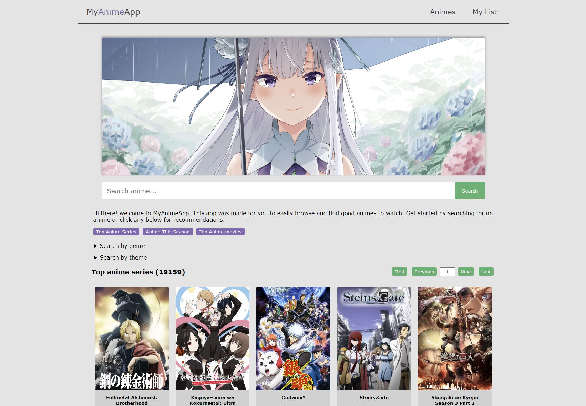

# MyAnimeApp

## Features
- search by genre/theme
- search by string
- view information about clicked anime
- reccomendations of clicked anime
- can go back to previously clicked (history)
- easy browsing and closing of modal
- no redirects only opens modal
- user can save anime to a list (automatically saved to local storage)
- pagination with custom input to go specific page
- parallel fetching for fast load/render
- easy view of related clicked anime images 
- anime trailer 
- highly mobile responsive

[Live view](https://pieton97.github.io/My-anime-app/)

